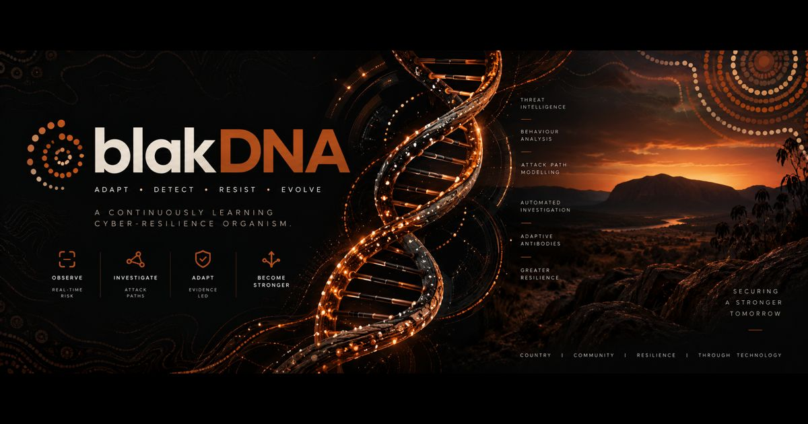
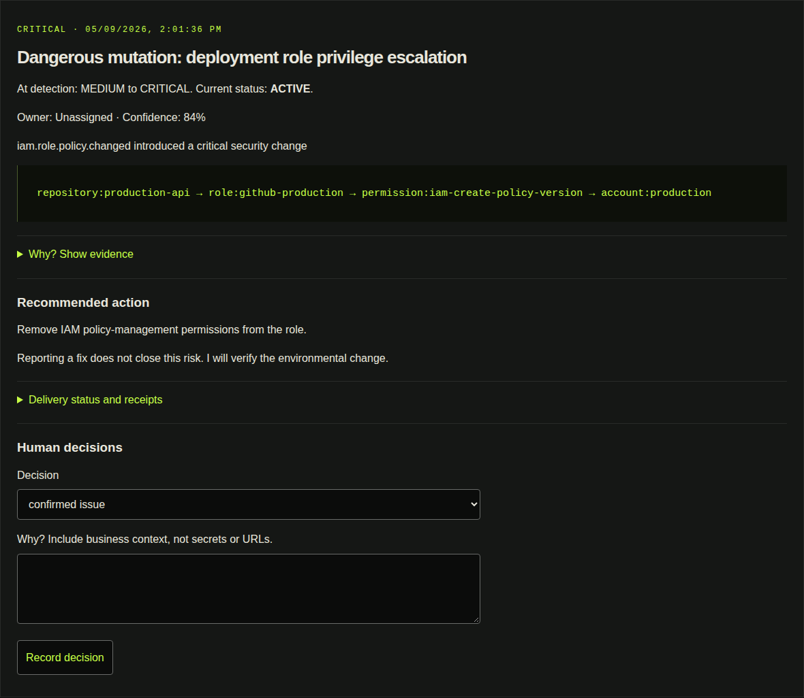

# blakDNA

Public marketing site for blakDNA, a continuously learning cyber-resilience organism.



Production target: [blakdna-landing.pages.dev](https://blakdna-landing.pages.dev). Deployment evidence is recorded in repository releases and pull requests; no Marketplace availability or customer production deployment is implied.

Contact: https://www.yumait.com.au/contact

This repository contains only public website material, not the application runtime or customer data.

## Actual product tour

[Explore all 12 product states](https://blakdna-landing.pages.dev/product/#product-tour): 40 authentic PNG captures cover the four current product routes, including full desktop/mobile pages and focused evidence, response, and immunity panels.



The source journey runs real authentication and organism processing against an isolated PostgreSQL database. AWS observations, the Hermes reasoning adapter, email, and notification receivers are explicitly synthetic. No tokens, customer data, browser storage, or application source are included here. Full-image links preserve all below-the-fold content; mobile visitors receive mobile captures rather than unreadable desktop thumbnails.

`public/images/product/manifest.json` records capture timestamps, dimensions, routes, and SHA-256 hashes. `tests/product-screenshots.test.mjs` verifies the public assets against that inventory. Refresh these files only from a passing, manually reviewed application screenshot journey; do not draw or fabricate product screens. The marketing browser journey verifies every chapter, image, and desktop/mobile link.

## Run locally

Use Node 22.18+ (Node 24 in CI) and pnpm 10.34.5.

```sh
pnpm install --frozen-lockfile
pnpm dev
pnpm test
pnpm build
pnpm test:site
```

Copy `.env.example` to `.env` if overriding public settings. `PUBLIC_SITE_URL` must be a real HTTPS origin without a path; it drives canonical URLs, sitemap, robots, and social metadata. `PUBLIC_SALES_URL` points at a real sales/contact destination. `PUBLIC_DEPLOY_URL` identifies the [public buyer repository](https://github.com/yumaitau/blakDNA-aws-deploy). These values are public, never secrets. `PUBLIC_INDEXING=0` builds a noindex preview with an empty sitemap and disallowing robots file.

## Test complete journeys

```sh
node scripts/check-build-configurations.mjs
CHECK_EXTERNAL_LINKS=1 pnpm test:site
DOCKER_CONTEXT=m3-max pnpm test:homelab
```

For native homelab proof, copy a clean checkout to the approved server and run `pnpm test:homelab` there. The harness builds the pinned Playwright Linux image, verifies the site, runs real browser journeys and axe checks across every route, compares desktop/mobile/light visual baselines, and enforces mobile Lighthouse budgets on home, architecture, AWS Marketplace, and contact: performance >=90, accessibility >=95, best practices >=95, SEO >=95. It copies evidence to `test-results` and `.lighthouseci` and removes only its uniquely named container.

To intentionally regenerate baselines after reviewing a design change, run `UPDATE_VISUALS=1 pnpm test:homelab`. Inspect the generated files under `tests/browser/visual`, then rerun without that flag. CI never approves new screenshots automatically. Browser dependencies are testing tools, not shipped client code.

## Publish

The site is static Astro output with no Cloudflare Functions. Merge only after green checks and content/visual review. From that exact clean `main` commit, run:

```sh
pnpm install --frozen-lockfile
pnpm build
pnpm test:site
pnpm dlx wrangler@4.129.0 pages deploy dist --project-name blakdna-landing --branch main
node scripts/verify-production.mjs
```

Authenticate Wrangler through an approved operator login or a narrowly scoped deployment token held outside the repository. Use the intended Cloudflare account. Verify HTTPS, canonical origin, sitemap, robots, banner bytes, CSP, CTA destinations, and the production browser journey after deployment. Record the commit, deployment ID, URL, and test results before announcing a release. Roll back by redeploying a previously verified static artifact or using Cloudflare's deployment rollback controls.

CI uses the current Lighthouse Node runner with explicit assertions rather than the legacy Lighthouse CI CLI dependency tree. This avoids introducing vulnerable archive and temporary-file tooling while retaining reproducible JSON reports and hard score gates.

## Public surfaces

- Product, how it works, architecture, trust/safety, AWS Marketplace model, deployment, and contact.
- Distinct explanatory pages for cyber-resilience organisms, Security Genome, attack paths, adaptive cyber immunity, and evidence-backed risk.
- Privacy, website terms, responsible disclosure, sitemap, robots, and `llms.txt`.
- No client analytics, customer logos, made-up screenshots, unsupported metrics, certification claims, or unpublished Marketplace identifiers.

Website code: MIT. Brand rights: see NOTICE. Content rationale and accessibility review: `docs/design-and-content.md`.
